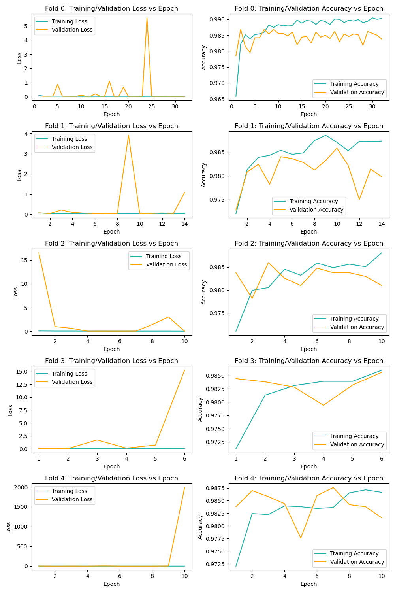
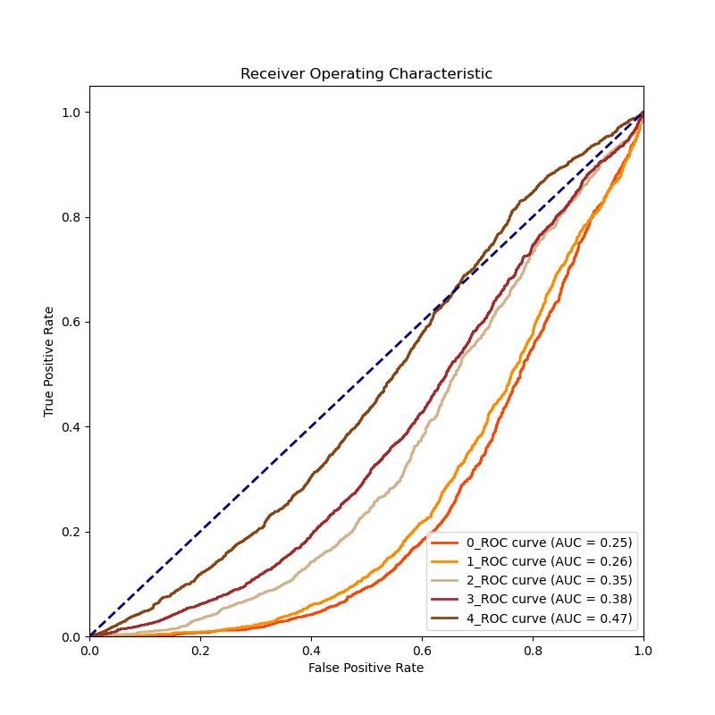
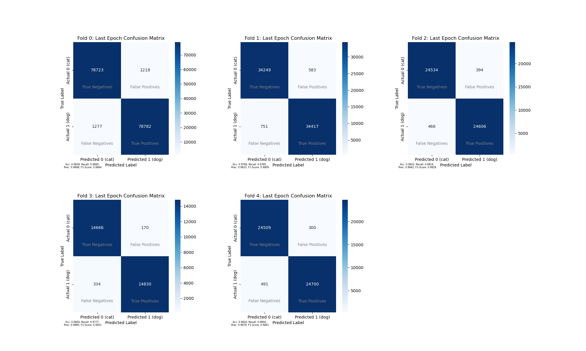

## Dogs vs. Cats Classification

#### Environment
This code is tested on Linux, CUDA Version: 11.7, Anaconda python 3.7 virtual environment.
Follow the instructions below for environment setting.

Make sure the pip version meets requirements `pip install --upgrade pip`. Otherwise, use `~/anaconda3/envs/myenv/bin/pip` instead of `pip` in the below.
```
conda create --name myenv python=3.7
conda activate myenv
pip install -r requirements.txt
```

#### Datasets
Datasets can be downloaded from [kaggle competition](https://www.kaggle.com/competitions/dogs-vs-cats).
Unzip and put the datasets under the data directory like this:
```
data
├── test
│   └── test1
│       ├── 10000.jpg
│       ├── 10001.jpg
|       ├──  ...
└── train
    ├── cat.0.jpg
    ├── dog.0.jpg
    ├── ...

```
Use your own custom dataset for data loading or **CatDogDataset** in ```datasets.py```.  

#### Setting
About model path, dataset path and training related parameters, see the details in `config.py`.  

#### Train
The default model is finetuned from EfficientNet-B5.  
If you are testing different models, use `python train.py`. It will consider k-fold cross-validation. (k default value: 5)  
If you are trainig for all datasets, use `python train_all.py`.  

#### Evaluate
Tools for evaluation. After training, some training process will be record to `record.npz`.  
These tools can plot Training/Validation loss, Training/Validation Accuracy, Confusion Matrix and ROC curve. Use them to evaluate the best model.  

Use `python evaluate.py --npz_path ./checkpoints/record.npz --plot all` to generate all evaluation results.  

<pre style="font-size: 14px;">

usage: evaluate.py [-h] [--npz_path NPZ_PATH] [--plot {cm,roc,lc,all}]
                   [--folds FOLDS]

Dog vs Cat Classification Evaluation

optional arguments:
  -h, --help            show this help message and exit
  --npz_path NPZ_PATH   The model path used for prediction (default:
                        checkpoints/best_model.pth)
  --plot {cm,roc,lc,all}
                        cm (confusion matrix), roc (roc curve), lc (learning
                        curve[loss, accuracy]), all(all of them), (default:
                        all)
  --folds FOLDS         k-fold cross-validation for training (default: 5)

</pre>

**Reminder** record.npz only be generated from `train.py`  
This model performance under 5-Fold Avearge is: **Val Acc:0.9831, Precision: 0.9857, Recall: 0.9804, F1-Score: 0.9831**  
image examples:  




#### Predict
Use `python predict.py` to generate submission csv files for Kaggle.   
(The raw competition is closed, you can try [this one](https://www.kaggle.com/competitions/dogs-vs-cats-redux-kernels-edition/submissions) instead.)  

<pre style="font-size: 14px;">
usage: predict.py [-h] [--checkpoint_path CHECKPOINT_PATH]
                  [--csv_name CSV_NAME]

Dog vs Cat Classification Predict

optional arguments:
  -h, --help            show this help message and exit
  --checkpoint_path CHECKPOINT_PATH
                        The model path used for prediction (default:
                        checkpoints/best_model.pth)
  --csv_name CSV_NAME   submission csv filename (default:
                        args.checkpoint_path/preds.csv)
</pre>
If you want to reproduce my experimental data, please use the following command to load the model: `python predict.py --checkpoints_path ./checkpoints/model.pth`.   
The submission score is **0.39236**.  
Get the [model]("https://drive.google.com/file/d/1nw3RCXgU720fhOUWCnydQnfxUFW4EvWD/view?usp=sharing")  by `wget`: (put under the ./checkpoints/ directory.)      
```wget "https://drive.usercontent.google.com/download?id=1nw3RCXgU720fhOUWCnydQnfxUFW4EvWD&export=download&authuser=5&confirm=t&uuid=989ac8f1-9fd4-434f-83c8-df54cdd43b0e&at=APZUnTVkGu2fVUby8NsvrF7wl98b:1706828674636" -O ./checkpoints/model.pth```  
